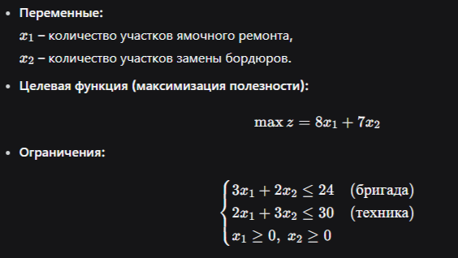
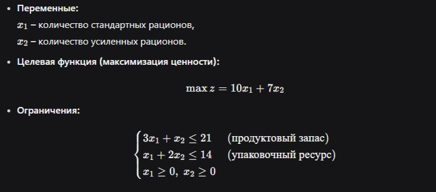
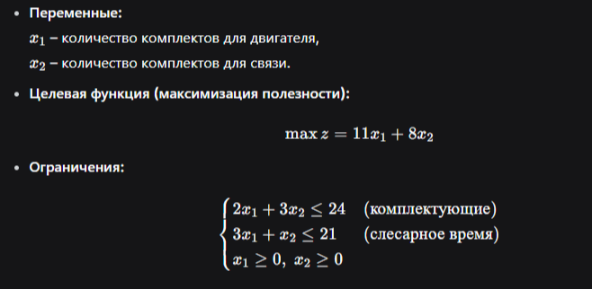

# Отчёт по лабораторной работе №1
## «Основы линейного программирования»

**Выполнил:** Самбуев Алдар Баирович
**Дата:** 02.06.2026

---

## Содержание

1. Кейс «Муниципальная пекарня»
2. Кейс «Городской ремонтный участок»
3. Кейс «Комплектование полевых рационов»
4. Кейс «Ремонтно-обслуживающий склад»

---

## 1. Кейс «Муниципальная пекарня»

### 1.1. Постановка задачи

**Переменные:**
- $x_1$ — количество хлебных наборов
- $x_2$ — количество булочных наборов

**Целевая функция (максимизация прибыли):**

$$\max z = 7x_1 + 5x_2$$

**Ограничения:**

$$\begin{cases} 4x_1 + 2x_2 \le 40 & \text{(мука)} \\ x_1 + 2x_2 \le 22 & \text{(печное время)} \\ x_1 \ge 0,\; x_2 \ge 0 \end{cases}$$

### 1.2. Геометрическое решение

**Вершины допустимой области и значения целевой функции:**

| Вершина | $x_1$ | $x_2$ | $z = 7x_1+5x_2$ |
|---------|-------|-------|-----------------|
| $O$     | 0     | 0     | 0               |
| $B$     | 10    | 0     | 70              |
| **$C$** | **6** | **8** | **82**          |
| $A$     | 0     | 11    | 55              |

**Оптимум:**

$$x_1^* = 6,\quad x_2^* = 8,\quad z_{\max} = 82$$

### 1.3. Проверка через `linprog` (Python)

```python
import numpy as np
from scipy.optimize import linprog

# Коэффициенты для задачи минимизации (max -> -min)
c = np.array([-7, -5])

# Ограничения A_ub @ x <= b_ub
A_ub = np.array([[4, 2],
                 [1, 2]])
b_ub = np.array([40, 22])

bounds = [(0, None), (0, None)]

result = linprog(c, A_ub=A_ub, b_ub=b_ub, bounds=bounds, method='highs')

print("Успех:", result.success)
print("x =", result.x)
print("Максимум z =", -result.fun)
```

**Результат выполнения:**

```
Успех: True
x = [6. 8.]
Максимум z = 82.0
```

---

## 2. Кейс «Городской ремонтный участок»

### 2.1. Постановка задачи



### 2.2. Геометрическое решение

**Вершины допустимой области и значения целевой функции:**

| Вершина | $x_1$   | $x_2$   | $z = 8x_1+7x_2$ |
|---------|---------|---------|-----------------|
| $O$     | 0       | 0       | 0               |
| $B$     | 8       | 0       | 64              |
| **$C$** | **2.4** | **8.4** | **78**          |
| $A$     | 0       | 10      | 70              |

**Оптимум:**

$$x_1^* = 2.4,\quad x_2^* = 8.4,\quad z_{\max} = 78$$

### 2.3. Проверка через `linprog`

```python
import numpy as np
from scipy.optimize import linprog

c = np.array([-8, -7])
A_ub = np.array([[3, 2],
                 [2, 3]])
b_ub = np.array([24, 30])
bounds = [(0, None), (0, None)]

result = linprog(c, A_ub=A_ub, b_ub=b_ub, bounds=bounds, method='highs')

print("Успех:", result.success)
print("x =", result.x)
print("Максимум z =", -result.fun)
```

**Результат выполнения:**

```
Успех: True
x = [2.4 8.4]
Максимум z = 78.0
```

---

## 3. Кейс «Комплектование полевых рационов»

### 3.1. Постановка задачи



### 3.2. Геометрическое решение

**Вершины допустимой области и значения целевой функции:**

| Вершина | $x_1$   | $x_2$   | $z = 10x_1+7x_2$ |
|---------|---------|---------|------------------|
| $O$     | 0       | 0       | 0                |
| $B$     | 7       | 0       | 70               |
| **$C$** | **5.6** | **4.2** | **85.4**         |
| $A$     | 0       | 7       | 49               |

**Оптимум:**

$$x_1^* = 5.6,\quad x_2^* = 4.2,\quad z_{\max} = 85.4$$

### 3.3. Проверка через `linprog`

```python
import numpy as np
from scipy.optimize import linprog

c = np.array([-10, -7])
A_ub = np.array([[3, 1],
                 [1, 2]])
b_ub = np.array([21, 14])
bounds = [(0, None), (0, None)]

result = linprog(c, A_ub=A_ub, b_ub=b_ub, bounds=bounds, method='highs')

print("Успех:", result.success)
print("x =", result.x)
print("Максимум z =", -result.fun)
```

**Результат выполнения:**

```
Успех: True
x = [5.6 4.2]
Максимум z = 85.4
```

---

## 4. Кейс «Ремонтно-обслуживающий склад»

### 4.1. Постановка задачи



### 4.2. Геометрическое решение

**Вершины допустимой области и значения целевой функции:**

| Вершина | $x_1$ | $x_2$ | $z = 11x_1+8x_2$ |
|---------|-------|-------|------------------|
| $O$     | 0 | 0 | 0 |
| $B$     | 7 | 0 | 77 |
| **$C$** | $\frac{39}{7} \approx 5.5714$ | $\frac{30}{7} \approx 4.2857$ | $\frac{669}{7} \approx 95.5714$ |
| $A$     | 0 | 8 | 64 |

**Оптимум:**

$$x_1^* = \frac{39}{7} \approx 5.5714,\quad x_2^* = \frac{30}{7} \approx 4.2857,\quad z_{\max} = \frac{669}{7} \approx 95.5714$$

### 4.3. Проверка через `linprog`

```python
import numpy as np
from scipy.optimize import linprog

c = np.array([-11, -8])
A_ub = np.array([[2, 3],
                 [3, 1]])
b_ub = np.array([24, 21])
bounds = [(0, None), (0, None)]

result = linprog(c, A_ub=A_ub, b_ub=b_ub, bounds=bounds, method='highs')

print("Успех:", result.success)
print("x =", result.x)
print("Максимум z =", -result.fun)
```

**Результат выполнения:**

```
Успех: True
x = [5.57142857 4.28571429]
Максимум z = 95.57142857142857
```

---

## Выводы по работе

1. **Математические модели** всех четырёх кейсов построены корректно, целевые функции и ограничения линейны.
2. **Геометрический метод** (перебор вершин допустимой области) позволил вручную найти оптимальные планы производства/комплектования.
3. **Численная проверка** с помощью `scipy.optimize.linprog` полностью подтвердила ручные расчёты.
4. В каждом случае оптимум достигается в вершине пересечения двух активных ограничений, что характерно для задач линейного программирования.
5. Полученные навыки позволяют в дальнейшем решать более сложные многомерные задачи ЛП.

---

## Приложение: полный код для всех кейсов (единый скрипт)

```python
import numpy as np
from scipy.optimize import linprog

def solve_lp(c, A_ub, b_ub, description):
    print(f"\n--- {description} ---")
    result = linprog(c, A_ub=A_ub, b_ub=b_ub, bounds=[(0, None), (0, None)], method='highs')
    print("Успех:", result.success)
    print("x =", result.x)
    print("Максимум z =", -result.fun)

# Кейс 1: Пекарня
c1 = np.array([-7, -5])
A1 = np.array([[4, 2], [1, 2]])
b1 = np.array([40, 22])
solve_lp(c1, A1, b1, "Муниципальная пекарня")

# Кейс 2: Ремонтный участок
c2 = np.array([-8, -7])
A2 = np.array([[3, 2], [2, 3]])
b2 = np.array([24, 30])
solve_lp(c2, A2, b2, "Городской ремонтный участок")

# Кейс 3: Полевые рационы
c3 = np.array([-10, -7])
A3 = np.array([[3, 1], [1, 2]])
b3 = np.array([21, 14])
solve_lp(c3, A3, b3, "Комплектование полевых рационов")

# Кейс 4: Ремонтный склад
c4 = np.array([-11, -8])
A4 = np.array([[2, 3], [3, 1]])
b4 = np.array([24, 21])
solve_lp(c4, A4, b4, "Ремонтно-обслуживающий склад")
```
