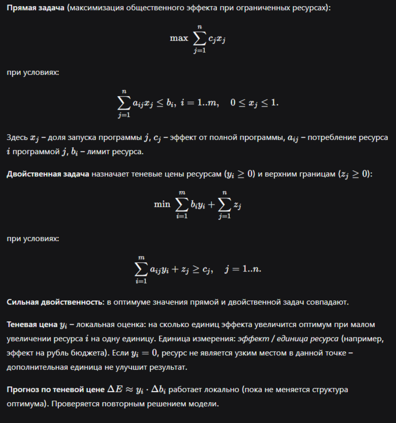

# Отчёт по лабораторной работе №3
## «Двойственность и анализ чувствительности»

**Выполнил:** Самбуев Алдар Баирович

---

## 1. Цель работы

Научиться использовать двойственность для интерпретации оптимального решения:
- определять активные (binding) ограничения и запас ресурса (slack);
- вычислять теневые цены ресурсов;
- проверять сильную двойственность;
- прогнозировать изменение оптимума при малых изменениях правых частей и коэффициентов цели;
- формулировать управленческие выводы о наиболее дефицитных ресурсах.

---

## 2. Теоретическая справка



---

## 3. Решение четырёх кейсов

### 3.1. Кейс «Муниципальное здравоохранение» (civil_01)

**Исходные данные:**

| Программа | Эффект | Бюджет | Труд | Ёмкость |
|-----------|--------|--------|------|---------|
| Выездные терапевтические бригады | 88 | 38 | 18 | 16 |
| Школьная вакцинация | 74 | 26 | 22 | 11 |
| Телемедицинские точки | 68 | 20 | 10 | 9 |
| Поддержка ФАП | 95 | 50 | 27 | 21 |

Лимиты: бюджет — 92, труд — 58, ёмкость — 46.

**Оптимальный план:**

$$x_1 = 1.0,\quad x_2 = 0.0,\quad x_3 = 1.0,\quad x_4 = 0.68$$

Программы 1 и 3 запущены полностью, программа 4 — на 68%, программа 2 не используется.
Оптимальный эффект: **233.84**.

**Ресурсный разбор:**

| Ресурс | Лимит | Slack | Shadow price | Binding |
|--------|-------|-------|--------------|---------|
| Бюджет | 92 | 0.0 | 0.739 | True |
| Трудозатраты | 58 | 0.0 | 2.174 | True |
| Ёмкость | 46 | 6.0 | 0.000 | False |

Наибольшая теневая цена у **трудозатрат** (2.174) — этот ресурс самый дефицитный. Нулевая теневая цена ёмкости означает, что её увеличение не повысит эффект: узкими местами являются бюджет и труд.

**Сценарии:**

| Сценарий | Прогноз | Факт |
|----------|---------|------|
| Бюджет +2 | +1.478 | +1.478 |
| Трудозатраты +3 | +6.522 | +6.522 |
| Эффект программы 1 +5 | — | +5.0 (новый оптимум 238.84) |

**Вывод:** наиболее дефицитен ресурс *трудозатраты* — увеличение его лимита даёт наибольший прирост общественного эффекта.

---

### 3.2. Кейс «Социальная защита в зимний период» (civil_02)

**Исходные данные:**

| Программа | Эффект | Бюджет | Труд | Ёмкость |
|-----------|--------|--------|------|---------|
| Пункты обогрева | 97 | 46 | 24 | 18 |
| Продуктовые сертификаты | 76 | 24 | 16 | 9 |
| Социальные патрули | 70 | 18 | 14 | 12 |
| Срочный ремонт жилья | 92 | 44 | 28 | 22 |

Лимиты: бюджет — 96, труд — 60, ёмкость — 50.

**Оптимальный план:**

$$x_1 = 1.0,\quad x_2 = 0.0,\quad x_3 = 1.0,\quad x_4 = 0.739$$

Оптимальный эффект: **248.44**.

**Ресурсный разбор:**

| Ресурс | Slack | Shadow price | Binding |
|--------|-------|--------------|---------|
| Бюджет | 0.0 | 1.478 | True |
| Труд | 0.0 | 1.870 | True |
| Ёмкость | 8.0 | 0.000 | False |

**Сценарии:**

| Сценарий | Прогноз | Факт |
|----------|---------|------|
| Бюджет +2 | +2.956 | +2.956 |
| Трудозатраты +2 | +3.739 | +3.739 |
| Эффект программы 1 +6 | — | +6.0 (новый оптимум 254.44) |

**Вывод:** для зимнего периода критичны *трудозатраты* — персонал для работы пунктов обогрева и ремонтных бригад.

---

### 3.3. Кейс «Бюджет логистической готовности» (military_01)

**Исходные данные:**

| Программа | Эффект | Бюджет | Л/с | Тех. ёмкость |
|-----------|--------|--------|-----|--------------|
| Резерв мобильных складов | 86 | 34 | 16 | 15 |
| Подготовка водителей | 72 | 22 | 18 | 10 |
| Комплекты перегрузочного оборудования | 78 | 28 | 14 | 13 |
| Усиление распределительных узлов | 93 | 46 | 24 | 21 |

Лимиты: бюджет — 94, личный состав — 56, тех. ёмкость — 48.

**Оптимальный план:**

$$x_1 = 1.0,\quad x_2 = 0.0,\quad x_3 = 1.0,\quad x_4 = 0.609$$

Оптимальный эффект: **232.00**.

**Ресурсный разбор:**

| Ресурс | Slack | Shadow price | Binding |
|--------|-------|--------------|---------|
| Бюджет | 0.0 | 1.174 | True |
| Личный состав | 0.0 | 2.174 | True |
| Тех. ёмкость | 9.0 | 0.000 | False |

**Сценарии:**

| Сценарий | Прогноз | Факт |
|----------|---------|------|
| Бюджет +3 | +3.522 | +3.522 |
| Личный состав +2 | +4.348 | +4.348 |
| Эффект программы 1 +5 | — | +5.0 (новый оптимум 237.00) |

**Вывод:** для логистической готовности ключевой ресурс — *личный состав*; дополнительные средства на персонал дадут наибольший прирост боеспособности.

---

### 3.4. Кейс «Модернизация ремонтной базы» (military_02)

**Исходные данные:**

| Программа | Эффект | Бюджет | Труд | Мощность |
|-----------|--------|--------|------|----------|
| Диагностические посты | 80 | 28 | 14 | 12 |
| Склад критических узлов | 74 | 24 | 11 | 10 |
| Мобильные ремонтные бригады | 88 | 36 | 21 | 16 |
| Испытательный участок | 92 | 44 | 24 | 18 |

Лимиты: бюджет — 90, труд — 54, мощность — 44.

**Оптимальный план:**

$$x_1 = 0.0,\quad x_2 = 0.0,\quad x_3 = 1.0,\quad x_4 = 0.918$$

Оптимальный эффект: **174.40**.

**Ресурсный разбор:**

| Ресурс | Slack | Shadow price | Binding |
|--------|-------|--------------|---------|
| Бюджет | 0.0 | 1.478 | True |
| Трудозатраты | 0.0 | 1.870 | True |
| Мощность | 7.0 | 0.000 | False |

**Сценарии:**

| Сценарий | Прогноз | Факт |
|----------|---------|------|
| Бюджет +2 | +2.956 | +2.956 |
| Трудозатраты +2 | +3.739 | +3.739 |
| Эффект программы 3 +4 | — | +4.0 (новый оптимум 178.40) |

**Вывод:** для ремонтной базы критичны *трудозатраты* — дополнительный персонал даст максимальный рост эффективности модернизации.

---

## 4. Общие выводы

1. Во всех четырёх кейсах два ресурса оказались активными (binding), а третий — с запасом.
2. Теневые цены позволили определить самый дефицитный ресурс: в гражданских кейсах — трудозатраты, в военных — личный состав / труд.
3. Прогнозы по теневой цене для малых изменений точно совпали с фактическими пересчётами, что подтверждает локальную линейность.
4. Двойственная задача — инструмент управленческого анализа: она показывает, куда вкладывать дополнительные ресурсы, чтобы получить максимальный прирост эффекта.

---

## 5. Код решения

Все четыре ноутбука используют одинаковые вспомогательные функции `solve_primal`, `solve_dual` и `rerun_with_resource_change`. Ниже приведены исходные данные и полный код для каждого кейса.

### 5.1. Кейс «Муниципальное здравоохранение» (`lab_03_student_civil_01.ipynb`)

```python
import numpy as np
import pandas as pd
from scipy.optimize import linprog

def solve_primal(effects, A_ub, b_ub, bounds):
    c = -effects
    result = linprog(c, A_ub=A_ub, b_ub=b_ub, bounds=bounds, method="highs")
    if not result.success:
        raise RuntimeError(result.message)
    shadow_prices = -result.ineqlin.marginals
    return result, shadow_prices

def solve_dual(effects, A_ub, b_ub):
    m, n = A_ub.shape
    c_dual = np.concatenate([b_ub, np.ones(n)])
    A_dual = -np.hstack([A_ub.T, np.eye(n)])
    b_dual = -effects
    dual_bounds = [(0, None)] * (m + n)
    result = linprog(c_dual, A_ub=A_dual, b_ub=b_dual, bounds=dual_bounds, method="highs")
    if not result.success:
        raise RuntimeError(result.message)
    return result

def rerun_with_resource_change(effects, A_ub, b_ub, bounds, resource_index, delta):
    new_b = b_ub.copy()
    new_b[resource_index] += delta
    result, _ = solve_primal(effects, A_ub, new_b, bounds)
    return new_b, result

effects = np.array([88, 74, 68, 95], dtype=float)
A_ub = np.array([[38, 26, 20, 50],
                 [18, 22, 10, 27],
                 [16, 11,  9, 21]], dtype=float)
b_ub   = np.array([92, 58, 46], dtype=float)
bounds = [(0, 1)] * len(effects)

program_names  = ['Выездные терапевтические бригады', 'Школьная вакцинация',
                  'Телемедицинские точки доступа', 'Поддержка районных ФАП']
resource_names = ['Бюджет', 'Трудозатраты', 'Операционная ёмкость']

print("\n=== Прямая задача ===")
primal_result, shadow_prices = solve_primal(effects, A_ub, b_ub, bounds)
dual_result = solve_dual(effects, A_ub, b_ub)
print(f"Оптимальный эффект (primal): {-primal_result.fun:.4f}")
print(f"Оптимальное значение dual:   {dual_result.fun:.4f}")
print(f"Сильная двойственность: {np.allclose(-primal_result.fun, dual_result.fun)}")

plan = pd.DataFrame({'программа': program_names,
                     'x*': np.round(primal_result.x, 4),
                     'эффект': effects})
print("\nОптимальный план:")
display(plan)

resources = pd.DataFrame({'ресурс': resource_names,
                          'лимит': b_ub,
                          'slack': np.round(primal_result.slack, 4),
                          'shadow_price': np.round(shadow_prices, 4),
                          'binding': np.isclose(primal_result.slack, 0)})
print("\nРесурсный разбор:")
display(resources)

scenarios = [('Бюджет +2', 0, 2), ('Трудозатраты +3', 1, 3)]
print("\n=== Сценарии изменения ресурсов ===")
for label, idx, delta in scenarios:
    _, new_res = rerun_with_resource_change(effects, A_ub, b_ub, bounds, idx, delta)
    predicted = shadow_prices[idx] * delta
    actual    = (-new_res.fun) - (-primal_result.fun)
    print(f"{label:20} прогноз: {predicted:.4f}, факт: {actual:.4f}, разница: {actual - predicted:.4f}")

print("\n=== Сценарий изменения коэффициента цели ===")
new_effects = effects.copy()
new_effects[0] += 5
new_result, _ = solve_primal(new_effects, A_ub, b_ub, bounds)
print(f"Изменение эффекта: {(-new_result.fun) - (-primal_result.fun):.4f}")
print(f"Новое значение x1: {new_result.x[0]:.4f}")
```

---

### 5.2. Кейс «Социальная защита в зимний период» (`lab_03_student_civil_02.ipynb`)

Структура кода идентична кейсу 1. Отличаются только исходные данные:

```python
effects = np.array([97, 76, 70, 92], dtype=float)
A_ub = np.array([[46, 24, 18, 44],
                 [24, 16, 14, 28],
                 [18,  9, 12, 22]], dtype=float)
b_ub   = np.array([96, 60, 50], dtype=float)
bounds = [(0, 1)] * len(effects)

program_names  = ['Пункты обогрева', 'Продуктовые сертификаты',
                  'Социальные патрули', 'Срочный ремонт жилья']
resource_names = ['Бюджет', 'Трудозатраты', 'Операционная ёмкость']

scenarios = [('Бюджет +2', 0, 2), ('Трудозатраты +2', 1, 2)]
# Сценарий по c: new_effects[0] += 6
```

---

### 5.3. Кейс «Бюджет логистической готовности» (`lab_03_student_military_01.ipynb`)

```python
effects = np.array([86, 72, 78, 93], dtype=float)
A_ub = np.array([[34, 22, 28, 46],
                 [16, 18, 14, 24],
                 [15, 10, 13, 21]], dtype=float)
b_ub   = np.array([94, 56, 48], dtype=float)
bounds = [(0, 1)] * len(effects)

program_names  = ['Резерв мобильных складов', 'Подготовка водителей снабжения',
                  'Комплекты перегрузочного оборудования', 'Усиление распределительных узлов']
resource_names = ['Бюджет', 'Личный состав', 'Техническая ёмкость']

scenarios = [('Бюджет +3', 0, 3), ('Личный состав +2', 1, 2)]
# Сценарий по c: new_effects[0] += 5
```

---

### 5.4. Кейс «Модернизация ремонтной базы» (`lab_03_student_military_02.ipynb`)

```python
effects = np.array([80, 74, 88, 92], dtype=float)
A_ub = np.array([[28, 24, 36, 44],
                 [14, 11, 21, 24],
                 [12, 10, 16, 18]], dtype=float)
b_ub   = np.array([90, 54, 44], dtype=float)
bounds = [(0, 1)] * len(effects)

program_names  = ['Диагностические посты', 'Склад критических узлов',
                  'Мобильные ремонтные бригады', 'Испытательный участок']
resource_names = ['Бюджет', 'Трудозатраты', 'Производственная ёмкость']

scenarios = [('Бюджет +2', 0, 2), ('Трудозатраты +2', 1, 2)]
# Сценарий по c: new_effects[2] += 4
```
